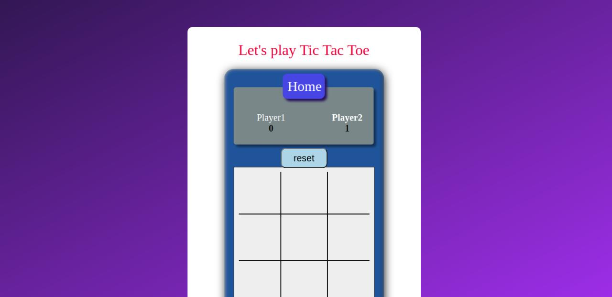
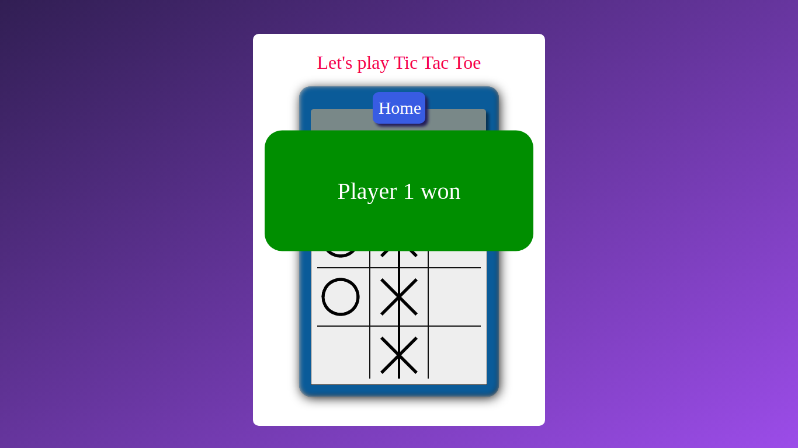

This is a TicTacToe game built in HTML and CSS for the front-end and Javascript for the responsiveness of the website.

###  Play The Game Here
<a href="https://anjalisoni3655.github.io/MarsCodeWar/">  Tic Tac Toe Game</a>

# Features Available :

## Player Options 
- Allows two human player game.
- One Human player and AI player of different depths.
- Two AI player playing together.

## Choose X/O 
- User can choose the sign "X" or "O" at the start of the game.

## Check scores 
- A scoreboard that updates the score of both the players after each game.

## Settings 
- A menu button is available to change the settings.
- The board resets to the original state after each game or another option to reset is to click on the RESET button.
- A Pop-up is displayed after each game declaring result in win/draw.

## Algorithm used
- The AI player uses MINIMAX algorithm to choose its next turn and it makes the AI player unbeatable.

## Additional algorithms used :
- ALPHA BETA PRUNING-> We have also used Alpha Beta Pruning which is a search algorithm that seeks to decrease the number of nodes that are evaluated by the minimax algorithm in its search tree(respective readme file for this algorithm is also available in the folder above).
- REINFORCEMENT LEARNING-> We have also used Reinforcement Learning to implement our game. Reinforcement learning is the training of machine learning models to make a sequence of decisions(respective readme file for this algorithm is also available in the folder above).
# Screenshots of the game (in case of minimax algorithm)

